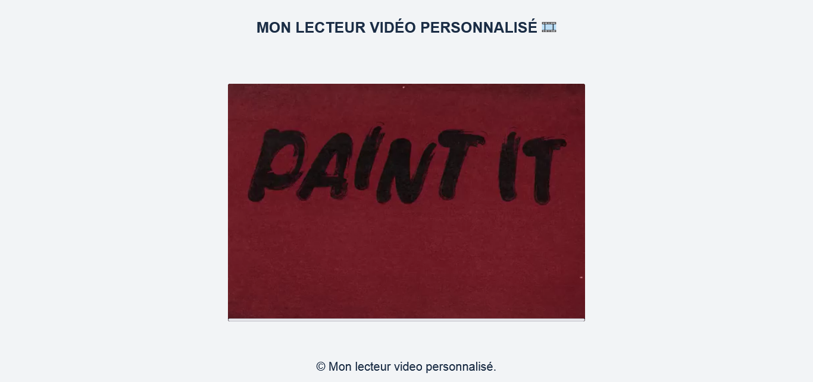

## MON LECTEUR VIDEO PERSONNALISE 🎞️

## Le challenge

Création d'un lecteur vidéo entièrement personnalisé en HTML5, CSS3 et JavaScript contenant notamment :

- un bouton play / pause
- un bouton mute / unmute
- un bouton pour mettre la vidéo en plein écran
- un input pour régler le volume

## Démonstration

Lien vers le projet : https://aperbet56.github.io/lecteur_video_personnalise/

## Projet développé avec

- Utilisation des balises sémantiques HTML5
- CSS3
- Flexbox
- Animations CSS
- Desktop first
- Page web responsive
- Utilisation d'un normaliseur : le fichier normalize.css
- JavaScript
- Code JavaScript commenté
